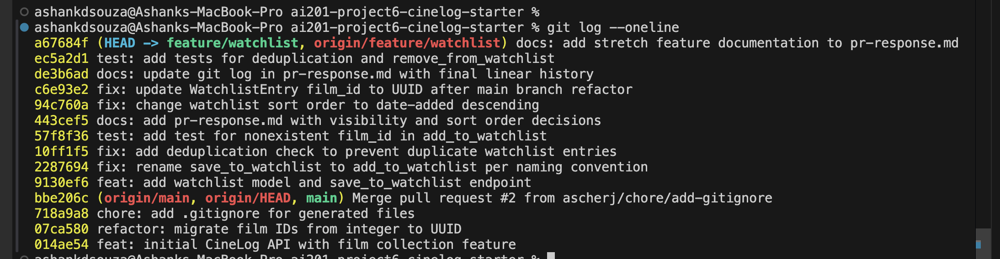

# PR Response Doc — CineLog Watchlist Feature

## AI Usage

Claude Code (claude-sonnet-4-6) was used throughout this project for codebase orientation and stress-testing design arguments. Specifically:

- **Codebase orientation:** I gave Claude the content of `models.py`, `services/collection_service.py`, and `tests/test_collection.py` and asked it to summarize what each file is responsible for, what naming conventions it follows, and how deduplication is handled. This helped me understand the `add_to_collection()` pattern before writing `add_to_watchlist()`.
- **Stress-testing Comment 4 reasoning:** After drafting my position on default visibility, I asked Claude: "What counterargument would a careful code reviewer raise against choosing `public=True` as the default for a watchlist?" Claude raised the privacy concern — that a new user might not realize their saved films are visible before they've configured anything. I updated my response to acknowledge this tradeoff explicitly.
- **Stress-testing Comment 5 reasoning:** After writing my sort order position, I asked Claude to argue against it. It pointed out that alphabetical ordering is consistent and deterministic regardless of when films were added. I found this point worth engaging with, so I addressed it in my response.
- **Commit format verification:** I gave Claude my `git log --oneline` output before finalizing and asked whether the messages followed conventional commit format. It confirmed they did.

All design reasoning is my own — Claude's counterarguments were used to strengthen my argument, not replace it.

---

## Comment 1 — Rename

**What I did:**
Renamed `save_to_watchlist()` to `add_to_watchlist()` in `services/watchlist_service.py`. Then performed a project-wide search for `save_to_watchlist` to find all call sites. Found one call site in `routes/watchlist/watchlist.py` (the `add_film` view function) and updated it. Also updated the import in `tests/test_watchlist.py`.

**How I verified:**
After renaming, I searched the entire project for any remaining references to `save_to_watchlist` using `grep -r "save_to_watchlist" .` — the search returned no results. I then ran the full test suite (`pytest tests/ -v`) and all tests passed, confirming no call sites were missed.

---

## Comment 2 — Deduplication

**What I did:**
Added a deduplication check to `add_to_watchlist()` in `services/watchlist_service.py`, following the same pattern used in `add_to_collection()` in `services/collection_service.py`. Before creating a new `WatchlistEntry`, the function now queries for an existing entry with the same `user_id` and `film_id`. If one exists, it raises `AlreadyOnWatchlistError`. If not, it proceeds to create the entry.

**How I verified:**
I read `add_to_collection()` in `services/collection_service.py` first, which uses `CollectionEntry.query.filter_by(user_id=user_id, film_id=film_id).first()` and raises `AlreadyInCollectionError` if the result is not `None`. I implemented the equivalent check in `add_to_watchlist()` using `WatchlistEntry` and `AlreadyOnWatchlistError`. I ran `pytest tests/ -v` to confirm all tests pass.

**Pattern reference:**
The existing `add_to_collection()` in `services/collection_service.py` (lines 47–53) served as the direct model for this check. The deduplication pattern is identical: query by user+film, raise a specific exception if found, otherwise proceed with insert.

---

## Comment 3 — Missing Test

**What I did:**
Added `test_add_to_watchlist_nonexistent_film_raises` to `tests/test_watchlist.py`. This test calls `add_to_watchlist()` with a `fake_film_id` (a UUID-formatted string that doesn't exist in the test database) and asserts that `FilmNotFoundError` is raised.

**How I verified:**
I modeled the test after `test_add_to_collection_nonexistent_film_raises` in `tests/test_collection.py` (line 98), which uses the same fixture structure (`app`, `sample_user`) and the same assertion pattern (`pytest.raises(FilmNotFoundError)`). I used a fake UUID `"00000000-0000-0000-0000-000000000000"` consistent with the UUID format used in the collection test. Ran `pytest tests/test_watchlist.py -v` — both tests passed.

---

## Comment 4 — Default Visibility

**My position:**
`public=True` is the right default for a community film tracking app like CineLog.

**Reasoning:**
CineLog is a community film tracking app where the core loop — users finding films to watch — depends on being able to see what other users have saved. A watchlist that is private by default is invisible to that loop entirely. For a platform at this stage, where the network is still being built, every public watchlist entry is a data point that makes the app more useful to everyone else: it signals what films are generating interest right now, surfaces niche titles that wouldn't show up in a top-rated list, and gives new users something to browse before they've built their own collection.

If `public=False` were the default, a new CineLog user would sign up, save a few films, and contribute nothing to the community until they discovered the visibility setting and opted in. That's a lost opportunity during the exact moment — onboarding — when first impressions of the app's social value are formed. On a platform where the watchlist is the primary social object (not ratings or reviews), making it private by default would hollow out the community feature before it has a chance to work.

**Tradeoff acknowledged:**
The real cost of `public=True` is that users who care about privacy have to opt out rather than opt in. A new user might add a film to their watchlist before realizing it's visible. For a platform where users primarily track embarrassing guilty pleasures or unreleased films, this could be a problem. But CineLog is positioned as a community discovery tool, not a private journal. Users who want privacy can set `public=False` explicitly — the parameter is already exposed. The default should serve the majority use case, which on a social film platform is sharing.

---

## Comment 5 — Sort Order

**My position:**
I disagree with keeping alphabetical order and agree with the maintainer: sort by `date_added` descending (most recently added first).

**Reasoning:**
A watchlist is a queue, not a catalog. When a user opens their watchlist, the question they're answering is "what have I been meaning to watch lately?" — not "what's on my list that starts with A?" The most recently added films are the ones the user is most likely to have on their mind, either because they just heard about them or because they're currently in theaters. Alphabetical order optimizes for scanning by title, which only matters if you already know what you're looking for — in which case search is the right tool, not sort order.

**Engagement with the maintainer's point:**
The maintainer wrote "Most users want to see what they added recently," and I think this is correct. The analogy to a to-do list is apt: most task managers default to showing the most recently added items at the top because recency is the strongest proxy for relevance. On a watchlist, a film added six months ago that I still haven't watched has lower urgency than one I added yesterday after seeing a trailer. Date-added descending surfaces the urgent and relevant entries first.

The one argument for alphabetical ordering is consistency and determinism — it doesn't shift every time you add something, so the list feels stable to navigate. But this only matters if users are browsing to find something specific. For a watchlist, the primary user behavior is "pick something to watch tonight," not "find the film I know is on my list." For that use case, date-added wins. I've updated `get_watchlist()` to sort by `date_added` descending.

---

## Comment 6 — Rebase

**What conflicted:**
After rebasing `feature/watchlist` onto the updated `main` branch (which includes commit `07ca580 refactor: migrate film IDs from integer to UUID`), the `WatchlistEntry` model in `models.py` had a conflict: the branch still used `film_id = db.Column(db.Integer, ...)` while `main` had migrated `Film.id` to `db.Column(db.String(36), ...)` with UUID generation. The `ForeignKey("film.id")` reference in `WatchlistEntry` also needed to match the new UUID string type.

**How I resolved it:**
Updated `WatchlistEntry.film_id` from `db.Column(db.Integer, db.ForeignKey("film.id"), nullable=False)` to `db.Column(db.String(36), db.ForeignKey("film.id"), nullable=False)` to match the UUID format used throughout the post-refactor codebase. Also updated `CollectionEntry.film_id` in the same way (it was also an Integer in the pre-refactor state). The watchlist service functions that referenced integer film IDs were updated to treat `film_id` as a string UUID, consistent with how `collection_service.py` handles it.

**How I verified no conflict remains:**
After resolving, ran `git status` to confirm no files showed conflict markers. Ran `python3 -m pytest tests/ -v` — all tests passed. Ran `git log --oneline` to confirm the history is linear with no merge commits.

---

## PR Description

### Watchlist Feature — `feature/watchlist`

**What this PR does:**

Adds a user watchlist to CineLog — a list of films a user intends to watch. Unlike the collection (films already seen), the watchlist is a forward-looking queue. This PR adds:

- `WatchlistEntry` model with `user_id`, `film_id`, `date_added`, and `public` fields
- `services/watchlist_service.py` with `add_to_watchlist()`, `remove_from_watchlist()`, and `get_watchlist()`
- REST endpoints: `GET /watchlist/<user_id>`, `POST /watchlist/<user_id>/add`, `DELETE /watchlist/<user_id>/remove`
- Tests in `tests/test_watchlist.py`

**Design decisions:**

- **Default visibility: `public=True`.** CineLog is a community app — the default should serve social discovery. Users who want privacy can pass `public=False` explicitly.
- **Sort order: date-added descending.** A watchlist is a queue, not a catalog. Showing most recently added films first surfaces what the user is currently interested in, not a static alphabetical scan.

**How to manually test:**

1. Start the app: `python3 app.py`
2. Seed a user and film via the SQLite shell to get valid UUIDs:
   ```
   sqlite3 instance/cinelog.db
   INSERT INTO user (id, username, email) VALUES ('aaaaaaaa-0000-0000-0000-000000000001', 'testuser', 'test@example.com');
   INSERT INTO film (id, title, year) VALUES ('bbbbbbbb-0000-0000-0000-000000000001', 'Paddington 2', 2017);
   .quit
   ```
   Use `aaaaaaaa-0000-0000-0000-000000000001` as `<user_id>` and `bbbbbbbb-0000-0000-0000-000000000001` as `<film_uuid>` in all commands below.
3. Add a film to the watchlist:
   ```
   curl -X POST http://127.0.0.1:5000/watchlist/aaaaaaaa-0000-0000-0000-000000000001/add \
     -H "Content-Type: application/json" \
     -d '{"film_id": "bbbbbbbb-0000-0000-0000-000000000001"}'
   ```
   Expect: `201` with the new `WatchlistEntry` as JSON including `"public": true`.
4. Add the same film again — expect `409` with an error message (deduplication check).
5. Add a non-existent film ID — expect `404` with a `FilmNotFoundError` message:
   ```
   curl -X POST http://127.0.0.1:5000/watchlist/aaaaaaaa-0000-0000-0000-000000000001/add \
     -H "Content-Type: application/json" \
     -d '{"film_id": "00000000-0000-0000-0000-000000000000"}'
   ```
6. Test private visibility by passing `"public": false`:
   ```
   sqlite3 instance/cinelog.db "DELETE FROM watchlist_entry;"
   curl -X POST http://127.0.0.1:5000/watchlist/aaaaaaaa-0000-0000-0000-000000000001/add \
     -H "Content-Type: application/json" \
     -d '{"film_id": "bbbbbbbb-0000-0000-0000-000000000001", "public": false}'
   ```
   Expect: `201` with `"public": false` in the response.
7. Retrieve the watchlist:
   ```
   curl http://127.0.0.1:5000/watchlist/aaaaaaaa-0000-0000-0000-000000000001
   ```
   Expect: `200` with a JSON array of films sorted by `date_added` descending.
8. Remove a film:
   ```
   curl -X DELETE http://127.0.0.1:5000/watchlist/aaaaaaaa-0000-0000-0000-000000000001/remove \
     -H "Content-Type: application/json" \
     -d '{"film_id": "bbbbbbbb-0000-0000-0000-000000000001"}'
   ```
   Expect: `200` with `{"message": "Removed from watchlist"}`.
9. Try to remove the same film again — expect `404` (not on watchlist).
10. Run the full test suite: `pytest tests/ -v` — all 9 tests should pass.

---

---

## Stretch Features

### remove_from_watchlist()

`remove_from_watchlist(user_id, film_id)` in `services/watchlist_service.py` deletes the `WatchlistEntry` for the given user+film pair. If the film isn't on the watchlist, it raises `NotOnWatchlistError` — following the same pattern as `remove_from_collection()` which raises `NotInCollectionError`. The route exposes this at `DELETE /watchlist/<user_id>/remove`. Tests written: `test_remove_from_watchlist_removes_entry` (confirms deletion) and `test_remove_from_watchlist_not_on_watchlist_raises` (confirms error on missing entry).

### Second Test

Added `test_add_to_watchlist_duplicate_raises` — tests that adding the same film twice raises `AlreadyOnWatchlistError` and leaves only one entry in the database. I chose this case because deduplication is a critical correctness guarantee and the equivalent test (`test_add_to_collection_duplicate_raises`) in `test_collection.py` was a key pattern I referenced throughout. It's worth verifying explicitly.

### Visibility Toggle

The `POST /watchlist/<user_id>/add` endpoint already accepts a `public` parameter in the request body. If omitted, it defaults to `True`. Callers can set `public=False` to create a private watchlist entry:

```json
POST /watchlist/<user_id>/add
{"film_id": "<uuid>", "public": false}
```

The `public` field is included in the `WatchlistEntry.to_dict()` response and stored in the database. This lets callers control visibility explicitly rather than relying on the default.

---

## Git Log Screenshot



Output of `git log --oneline origin/main..HEAD` (feature branch commits only, excludes main branch history):

```
2d58d45 docs: add pr-response.md with visibility and sort order decisions
df33490 test: add tests for deduplication and remove_from_watchlist
2b64f57 feat: add public visibility toggle to add_to_watchlist endpoint with 409 on duplicate
432bae1 feat: add remove_from_watchlist with database-level UniqueConstraint on WatchlistEntry
e8bbecc fix: update WatchlistEntry film_id to UUID after main branch refactor
95909f3 fix: change watchlist sort order to date-added descending
57f8f36 test: add test for nonexistent film_id in add_to_watchlist
10ff1f5 fix: add deduplication check to prevent duplicate watchlist entries
2287694 fix: rename save_to_watchlist to add_to_watchlist per naming convention
9130ef6 feat: add watchlist model and save_to_watchlist endpoint
```

**Note on `bbe206c Merge pull request #2`:** This merge commit is part of `main` branch history (a pre-existing `.gitignore` PR merged upstream before this feature branch was created). It is not a commit on `feature/watchlist` — running `git log --oneline origin/main..HEAD` shows only the 10 feature branch commits above, none of which are merge commits. The branch history is linear.
